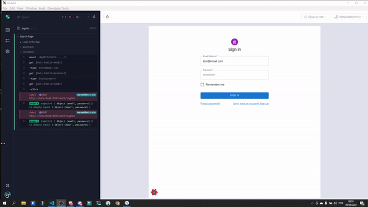

# Tela de Login Material Cy.expect()

## Intuíto do projeto
- Desenvolver uma aplicação simples utilizando conceitos importantes para aplicações React.
- Testar aplicação utilizando o Cypress CT
- Arquitetura em "hooks" deixando o markdown ter acesso somente as funções que  a interessa, algo que melhora a legibilidade e manutenção do código.

## Ferramentas e libs

- React 18 
- Typescript
- Cypress 10
- Vite
- Material UI
- React Query
- React Hook Forms

## Motivos ao qual utilizei estas ferramentas
- O React é a biblioteca mais popular do JavaScript e é usada para construir uma interface de usuário (IU). Ela oferece uma resposta excelente para o usuário adicionar comandos usando um novo método de renderizar sites.
- O TypeScript é um superset que serve para potencializar a linguagem JavaScript. Com ele é possível construir projetos complexos sem nenhum empecilho. Além disso, ele oferece uma forte tipagem que permite maior desempenho e produtividade na hora de executar uma aplicação.
- O Cypress é um framework para automação de testes end-to-end, onde atualmente usa a linguagem JavaScript e roda em vários navegadores como Chrome, Firefox, Edge, entre outros.
- Material UI é um framework CSS que possui varios componentes prontos, algo que agiliza muito o desenvolvimento.
- React Query é uma das ferramentas de gerenciamento de estado que tem uma abordagem diferente do Flux, Redux e Mobx. Ele apresenta os principais conceitos de Estado-do-Cliente e Estado-do-Servidor.
- O React Hook Forms é uma biblioteca que auxiliará a organizar e padronizar as validações dos formulários por toda a aplicação.

## Como rodar o projeto

### É necessário ter o Node 16 ou superior instalado.
`yarn install ou npm install`

`yarn run dev npm run dev`

## Para abrir o Cypress 

`yarn cypress open`

## Escolha o Component Testing 
abra o arquivo signin.cy.tsx

## TO DO
- [ ] Validações no formulario, impedindo de enviar uma senha com menos de 6 caracteres e garantindo que o email segue o padrão.
- [ ] Testar se enviando um valor diferente de um email, ou uma senha com menos que 6 caracteres irá emitir uma mensagem de e impedir que a request seja enviada se os valores não forem corretos.